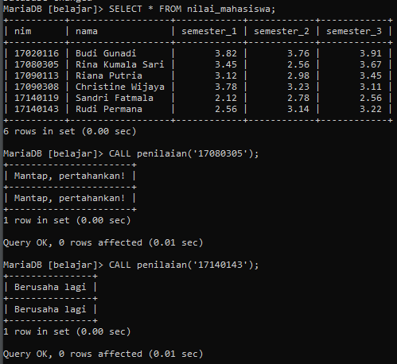

# Tugas_13_MySQL

### Buat ulang procedure penilaian(). Stored procedure penilaian() nantinya menerima 1 buah parameter berupa kode nim mahasiswa. Berdasarkan kode nim ini, cari nilai IP semester_1 dari mahasiswa tersebut. Hasil akhir dari procedure penilaian() berupa string, tergantung nilai IP semester_1 dari mahasiswa tersebut.


### Aturannya adalah sebagai berikut:
###    -  IPK 0.00 - 1.00: ‘Serius kuliah g sih?’
###    -  IPK 1.01 - 2.00: ‘Kebanyakan main’
###    -  IPK 2.01 - 3.00: ‘Berusaha lagi’
###    -  IPK 3.01 - 4.00: ‘Mantap, pertahankan!’
###    -  Selain itu: ‘Nilai tidak sesuai’


### Berikut hasil akhir yang diinginkan dari pemanggilan stored procedure penilaian():
```mysql
CALL penilaian('17080305');
--Mantap, pertahankan!
```

```mysql
CALL penilaian('17140143'); 
--Berusaha lagi
```

### Silahkan teman-teman coba rancang kode programnya!

### **Tips:**
### Membuat procedure ini butuh beberapa langkah:
### 1. Ambil nilai argumen yang berupa nim lalu input ke dalam SELECT...WHERE untuk mencari nilai semester_1 dari mahasiswa tersebut.
### 2. Siapkan sebuah variabel untuk menampung nilai semester_1 hasil dari langkah nomor 1.
### 3. Buat kondisi IF ELSEIF ELSE atau CASE puntuk mengkonversi nilai semester_1 menjadi string dengan aturan di dalam soal.

```mysql
DROP PROCEDURE IF EXISTS penilaian;
```

```mysql
CREATE PROCEDURE penilaian(nim_mhs CHAR(8)) 
BEGIN 
	DECLARE nilai_ip DECIMAL(4,2) DEFAULT 0.00; 
	SELECT semester_1 INTO nilai_ip FROM nilai_mahasiswa WHERE nim = nim_mhs; 
CASE 
	WHEN ((nilai_ip >= 0.00) AND (nilai_ip <= 1.00)) THEN 
		SELECT 'Serius kuliah g sih?'; 
	WHEN ((nilai_ip > 1.00) AND (nilai_ip <= 2.00)) THEN 
		SELECT 'Kebanyakan main'; 
	WHEN ((nilai_ip > 2.00) AND (nilai_ip <= 3.00)) THEN 
		SELECT 'Berusaha lagi'; 
	WHEN ((nilai_ip > 3.00) AND (nilai_ip <= 4.00)) THEN 
		SELECT 'Mantap, pertahankan!'; 
	ELSE 
		SELECT 'Nilai tidak sesuai'; 
	END CASE; 
END// 
```

```mysql
CALL penilaian('17080305');
--Mantap, pertahankan!
```

```mysql
CALL penilaian('17140143'); 
--Berusaha lagi
```


